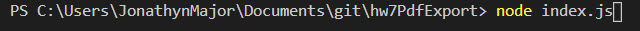
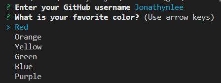

# hw7PdfExport

# TABLE OF CONTENTS
### About
### Directions
### Additional Inforamtion

# ABOUT
In this program, you will be able to produce a profile for any github account. It will look as such.

# DIRECTIONS
 To use the program:
 1) Run node index.js on the command line  
 2) Enter the Username and Pick a favorite color 
 3) Open the downloaded pdf and select any of the titles with icons (Location, GitHhub, Blog).These links will be directly connected to the account you listed. 
 
 # ADDITIONAL INFORMATION
 All Data on the sheet come from the projile that you type in. That information includes:
 - profile name
 - Profile Image
 - BlogURl
 - Location
 - Github Url
 - Bio
 - Public Repositiories
 - Number of Followers
 - Number of Github Stars
 - Number Following